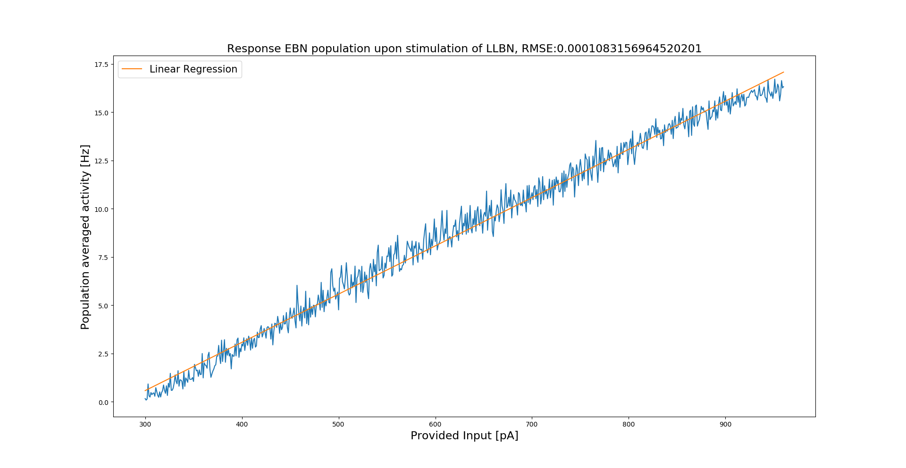
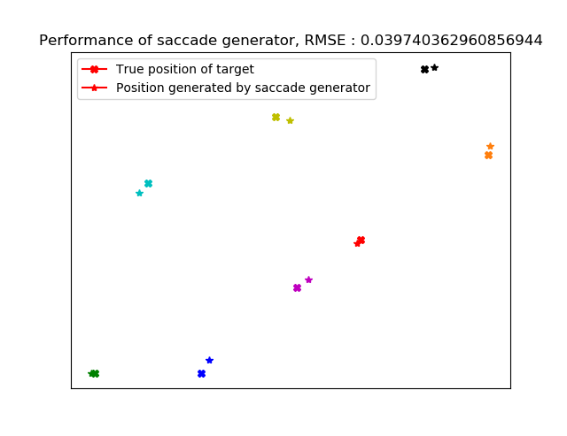

# Spiking Saccade Generator

## Introduction
This repository contains an implementation of a spiking neural network model of the saccade generator in the reticular formation inspired by *A neural model of the saccade generator in the reticular formation* by G. Gancarz, S. Grossberg, Neural Networks 11, 98.  
The spiking neural network consists of four recurrently connected populations of spiking neurons which again are interconnected according to a random connection scheme.  
These populations correspond to populations of neurons found in the reticular formation exhibiting similar response in electrophysiological experiments
( see e.g. *The brainstem burst generator for saccadic eye movements* by Scudder et al., Exp Brain Res 02, for a review) and are believed to play different roles in the saccade generation process.  
The four populations are long-lead burst neurons (LLBN), short-lead burst neurons (SLBN) consisting of excitatory burst neurons (EBN) and inhibitory burst neurons (IBN) as well as omni-pause neurons (OPN).  
Electrophysiological studies show, that in the time between two saccades the OPN fire regularly and inhibit the EBN. Upon initiation of the saccade generation
process started by providing the LLBN with a signal encoding the desired displacement of the saccadic jump, the LLBN inhibit the OPN and excite the EBN.
Due to the disinhibition of the EBN via the OPN and the direct excitation, the EBN themselve begin to burst. The activity of the EBN is not only passed to the motor-neurons
but also directed to the IBN, which in turn upon activation inhibit the LLBN. Due to the absence of inhibition the OPN become active again and deactivate the EBN.
This leads to a reset of the circuit to a state qualitatively identical to the initial one.  
The interconnections between the four populations are schematically depicted below.  
  
This fundamental building block takes responsibility for the movement of the eyes in **one** direction, e.g. horizontally left or vertically downwards.  
To build a complete saccade generator, one first patches together two of these fundamental building blocks collapsing the two OPN populations into one, thereby obtaining a saccade generator
for either horizontal or vertical saccades. For the second axis, one just duplicates this circuit.   
In the model, the LLBN and the SLBN consist of two interconnected populations of excitatory and inhibitory Multi-timescale adaptive threshold model neurons ( see *Made-to-order spiking neuron model equipped with a multi-timescale adaptive threshold* by Kobayashi et al., Frontiers in Computational Neuroscience 09) exhibiting bursty behaviour.
We will call the excitatory population of SLBN EBN for simplicity sake.  
The OPN consist of two interconnected populations of excitatory and inhibitory Leaky Integrate-And-Fire neurons.  
The IBN consist of one interconnected population of inhibitory Multi-timescale adaptive threshold neurons again showing bursty behaviour.  
The provided network satisfies Dale's principle and qualitatively takes different neuron characteristics (the distinction between bursting
and non-bursting neurons) found in the reticular formation into account.  
Our modles differs from the one described by Gancarz and Grossberg in the respect that they model the saccade generator with neural populations, i.e. they represent the network with a system of coupled differential equations where each populations is described via on of these equation.  
Our network, however, is more biologically plausible since it operates with spiking neurons whicht not only satify Dale's principle but also exhibit - motivated by the neurons found in the saccade generator - bursty dynamics.  
All simulation were carried out with nest-2.18 using the pynest interface (Jordan, Jakob et al. (2019). NEST 2.18.0. Zenodo. 10.5281/zenodo.2605422.).
## Results
The constructed network exhibits above described reset property if provided with sustained input.  
  
Moreover, the EBN show a linear response upon sufficiently strong stimulation of the LLBN.  
  
This allows for a linear readout of the activity of the EBN to determine the saccade size.  
Building a complete saccade generator, one obtains the following:  
   
This shows the functionality of our spiking network model of the saccade generator.

## Usage
In order to use the saccade generator one needs to first construct the network
```
from saccade_generator import construct_saccade_generator

sg = construct_saccade_generator()

# fetch horizontal and vertical saccade generators
horizontal_sg = sg['horizontal']
vertical_sg = sg['vertical']

# fetch compartments controlling one extraocular muscle
left_llbn = horizontal_sg['LLBN_l']
right_llbn = horizontal_sg['LLBN_r']

up_llbn = vertical_sg['LLBN_u']
down_llbn = vertical_sg['LLBN_d']
```
For a more detailed description see the documentation in the code.  
To elicit a saccade, say, to the left one needs to provide the left LLBN with a dc current for 75. ms.  
The stimulus strength provided to the saccade generator to produce a saccade of a given size need to be first normed by the maximal saccade size.  
This normed value then can be used to determine the amplitude of the dc current.  
The spikes of the EBN are counted in a time window of 200 ms after the sitmulus onset. Using this data, one calculates the population averaged firing rate and from this
may obtain the relative size of the saccade. To get the actual size, the produced values needs to be scaled by the maximal saccade size.  
For more information see the evaluation scripts **saccade_generator_eval.py** and **saccade_generator_single_side_eval.py** as well as **saccadic_size_single_side.py**.

## Requirements
See environment.yml.

## License
CC BY-NC-SA 4.0 (https://creativecommons.org/licenses/by-nc-sa/4.0/, see License.md).
